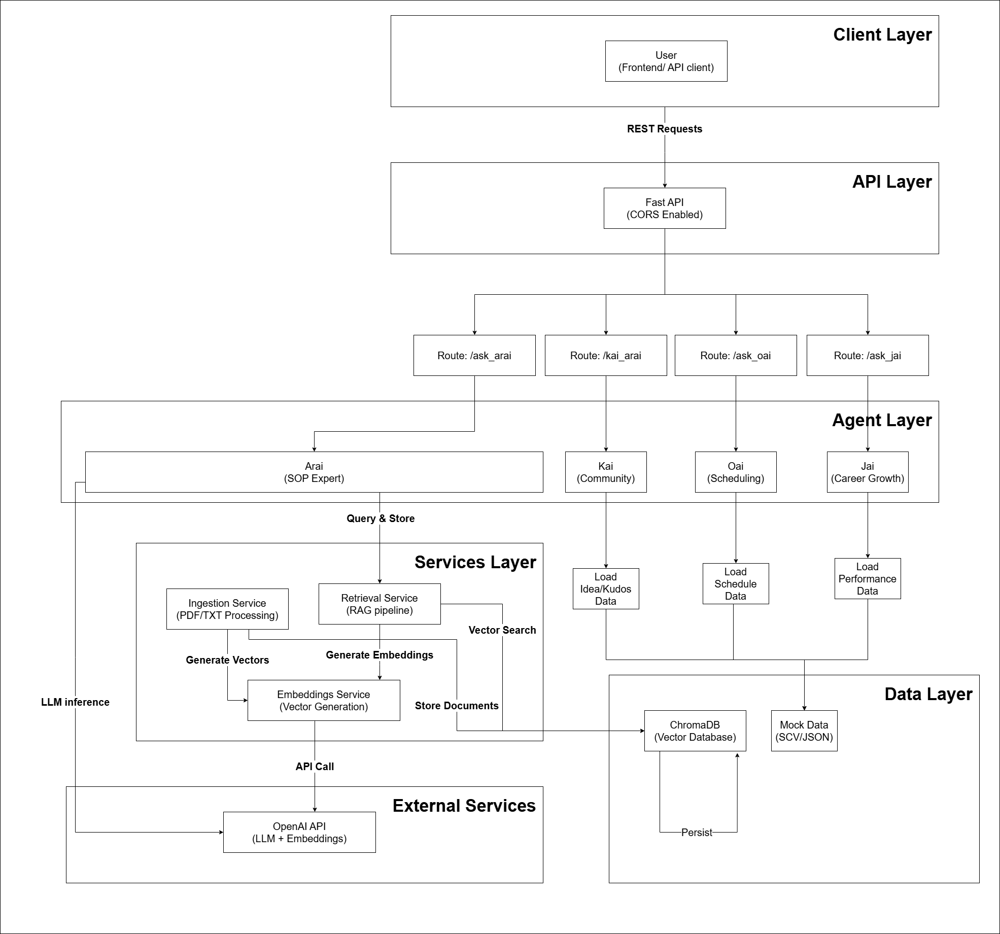

# FAN – Franchise AI Navigator  
### Multi-Agent AI Platform for Workforce Optimization

FAN (Franchise AI Navigator) is a multi-agent AI backend system designed to reduce employee turnover and operational friction in franchise businesses.

It transforms the “first job” experience by providing:
- Instant SOP guidance
- Fair and optimized scheduling
- Personalized career growth paths
- Community-driven innovation and recognition

This repository contains the backend architecture powering FAN.

---

## Architecture Diagram


## System Overview

FAN is built using a modular multi-agent architecture:

- **Arai** – On-demand SOP expert powered by Retrieval-Augmented Generation (RAG)
- **Jai** – Career development engine providing growth paths and skill recommendations
- **Oai** – Fairness-aware shift scheduling assistant
- **Kai** – Community engagement platform for idea submission, kudos, and manager insights

The backend exposes REST APIs built with FastAPI and integrates vector search using ChromaDB and LLM inference via OpenAI APIs.

---

## Architecture

High-Level Flow:

1. User sends query (voice/text)
2. Request routed to selected agent
3. Agent executes logic:
   - RAG retrieval (if needed)
   - Rule-based reasoning
   - LLM generation
4. Structured response returned

Tech components:

- FastAPI (API layer)
- ChromaDB (Vector database)
- SentenceTransformers (Embeddings)
- OpenAI API (LLM reasoning)
- Docker (Containerization)

---
## Design Decisions

- Modular agent-based architecture for scalability
- Hybrid rule-based + LLM reasoning for controllability
- Deterministic post-processing to reduce hallucinations
- Separation of retrieval and generation layers
- Dockerized deployment for environment consistency

## RAG Pipline

1. Training manuals ingested (PDF/TXT)
2. Text chunked into sections
3. Embeddings generated via SentenceTransformers
4. Stored in ChromaDB vector store
5. Top-k similarity search at query time
6. Retrieved context injected into LLM prompt
7. Response generated with source attribution


## Agent Design (Technical Overview)

### Arai – SOP Expert
- Uses document chunking + embeddings
- Stores vectors in ChromaDB
- Retrieves top-k relevant sections
- Sends structured prompt to LLM
- Returns contextual answer with sources

### Jai – Career Growth Engine
- Loads performance data (CSV-based simulation)
- Rule-based skill gap detection
- Generates personalized weekly nudges
- Determines next role progression

### Oai – Smart Scheduling
- Simulated workload balancing
- Fairness logic to reduce burnout
- Optimizes shift distribution

### Kai – Team Culture Agent
- Idea submission system
- Upvote mechanism
- Kudos recognition tracking
- Manager summary analytics

---

## Project Structure
```
fan-backend/
├── app/
│   ├── __init__.py
│   ├── main.py                           Main FastAPI app entry point
│   ├── agents/
│   │   ├── __init__.py
│   │   ├── arai_agent.py                 (Q&A with RAG)
│   │   ├── jai_agent.py                  (Career development)
│   │   ├── kai_agent.py                  (Ideas & recognition)
│   │   └── oai_agent.py                  (Schedule optimization)
│   ├── services/
│   │   ├── __init__.py
│   │   ├── retrieval.py                  (Chroma DB retrieval)
│   │   ├── ingestion.py                  (PDF ingestion)
│   │   └── embeddings.py                 (Embedding utilities)
│   ├── schemas/
│   │   ├── __init__.py
│   │   └── api_models.py                 (Pydantic request models)
│   └── utils/
│       ├── __init__.py
│       └── helpers.py                    (CSV/JSON utilities)
│
├── data/
│   └── mock/                             All data files
│       ├── ideas.csv
│       ├── kudos.csv
│       ├── challenges.json
│       ├── career_path.json
│       ├── nudge_library.json
│       ├── mock_performance.csv
│       └── schedule.csv
│
├── tests/                                Test files
│   ├── __init__.py
│   ├── test_api.py
│   └── test_retrieval.py
│
├── docs/                                 Documentation
│
├── .env.example
├── requirements.txt
├── Procfile
├── README.md
├── LICENSE
└── .gitignore
```

## Installation

### 1. Clone Repository

```
git clone https://github.com/YOUR_USERNAME/ai-agent.git
cd ai-agent
```

### 2. Create Virtual Environment

```
python -m venv venv
venv\Scripts\activate   # Windows
```

### 3. Install Dependencies

```
pip install -r requirements.txt
```

### 4. Configure Environment Variables

create .env file:
```
OPENAI_API_KEY = your_api_key
```
### 5. Run Server

```
uvicorn app.main:app --reload
```


## Docker Setup (Optional)
Build:
```
docker build -t fan-backend .
```
Run:
```
docker run -p 8000:8000 fan-backend
```
## Future Improvement
- Production-grade database integration
- Authentication & role-based access
- Real-time scheduling optimization
- Deployment monitoring
- Multi-branch analytics dashboard

## Author
Developed as part of a hackathon project and later refactored into a modular, scalable backend system.

Focus: AI Systems, Backend Architecture, Multi-Agent Design


